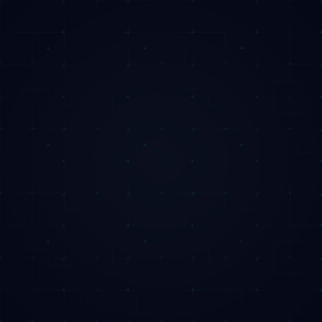

  

  

  

### ⚙️ Tech Stack

 

 

### 📊 GitHub Stats

### 🐍 Contribution Snake

### 🔗 Connect With Me

### 🚀 Featured Projects

---

*"The best way to predict the future is to invent it."* — **Alan Kay**

---

### 💭 Daily Dev Quote

---

**© 2025 Ömer Tahir Üstün** · Built with 💙 and **Neovim** on **Arch Linux**

